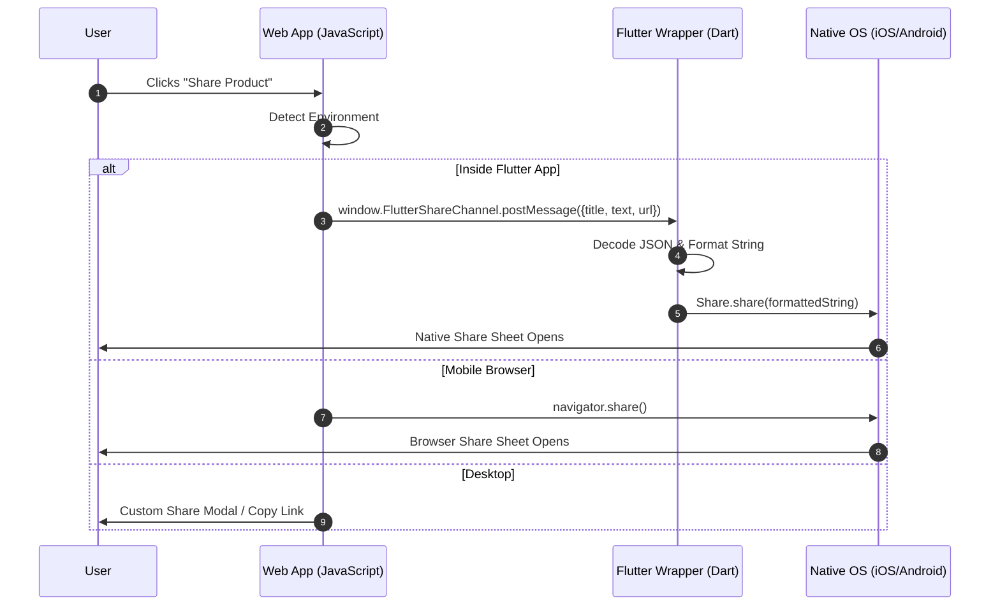

# Product Sharing Mechanism Analysis

Based on the documentation in your `FLUTTER_WEBVIEW_SHARE_GUIDE.md` file, here is a complete, deep analysis of exactly how your product sharing functionality works, the technologies it uses, and the underlying flow.

## Overview

Your application uses a **hybrid sharing approach**. It seamlessly bridges your web application (which is loaded inside a mobile WebView) with the native device's operating system (iOS or Android) using a JavaScript Interface. This allows the web app to trigger the **Native OS Share Sheet** (which contains apps like WhatsApp, Messages, Instagram, etc.), providing a high-quality, native user experience instead of a clunky web-based popup.

---

## What It Is Using

To achieve this, the system relies on the following key technologies and packages:

1.  **Flutter SDK**: The mobile application wrapper.
2.  **WebView Plugin**: Either `webview_flutter` (the official standard) or `flutter_inappwebview` (a feature-rich alternative). This renders the web app inside the mobile app.
3.  **`share_plus` (^7.2.1)**: A popular Flutter package that provides access to the native share dialogs on iOS and Android.
4.  **JavaScript Bridge (Message Channels)**: A communication layer that allows the JavaScript running on the website to send messages directly to the Dart/Flutter code.

---

## How It Works (Step-by-Step Flow)

Here is the exact step-by-step process of what happens when a user attempts to share a product:

### 1. User Interaction (Web Side)
The user is browsing the store and taps the **"Share"** button on a product page. 

### 2. Environment Detection (JavaScript)
The JavaScript code handling the button click performs an environment check to see *where* the app is currently running. It follows a fallback hierarchy:
*   **Check A (Is it in Flutter?):** It checks if `window.FlutterShareChannel` (or a custom `share` handler) exists in the global window object. If it does, it knows the user is inside the native mobile app.
*   **Check B (Is it a mobile browser?):** If not in Flutter, it checks if the browser supports `navigator.share()` (the Web Share API).
*   **Check C (Fallback):** If neither is supported (e.g., viewing on a desktop Chrome browser), it falls back to a custom UI modal or just copies the link to the clipboard.

### 3. Bridging to Native (Web to Flutter)
Assuming the user is inside the Flutter app (Check A passes), the JavaScript sends a message over the bridge. It constructs a JSON object containing the share details:
```json
{
  "title": "Product Title",
  "text": "Check out this awesome product!",
  "url": "https://yourwebsite.com/product/123"
}
```
It then fires: `window.FlutterShareChannel.postMessage(JSON.stringify(data));`

### 4. Interception and Processing (Flutter Side)
The Flutter app is constantly listening to this specific JavaScript channel. When it receives the message:
1.  **Decoding:** It parses the incoming JSON string back into a Dart `Map`.
2.  **Formatting:** It extracts the `title`, `text`, and `url`, and formats them together into a single cohesive string, automatically handling spacing and newlines.

### 5. Triggering the OS Share Sheet
Finally, the Flutter app takes the formatted string and passes it to the `share_plus` plugin by executing:
```dart
await Share.share(shareContent, subject: title);
```
This command communicates directly with the underlying Android/iOS operating system, commanding it to slide up the native Native Share Sheet. The OS takes over from here, allowing the user to select an app (like WhatsApp) to send the formatted text and URL.

---

## Summary of the Architecture Flow

> [!NOTE] 
> This is a visualization of the architecture flow explained above.



## Why this architecture is good:
*   **Native Feel:** Mobile users get the exact UI they expect from their OS.
*   **Single Codebase for UI:** Your product sharing UI is maintained purely on the web side.
*   **Robust Fallbacks:** It gracefully handles users who are not using the mobile app without breaking.
